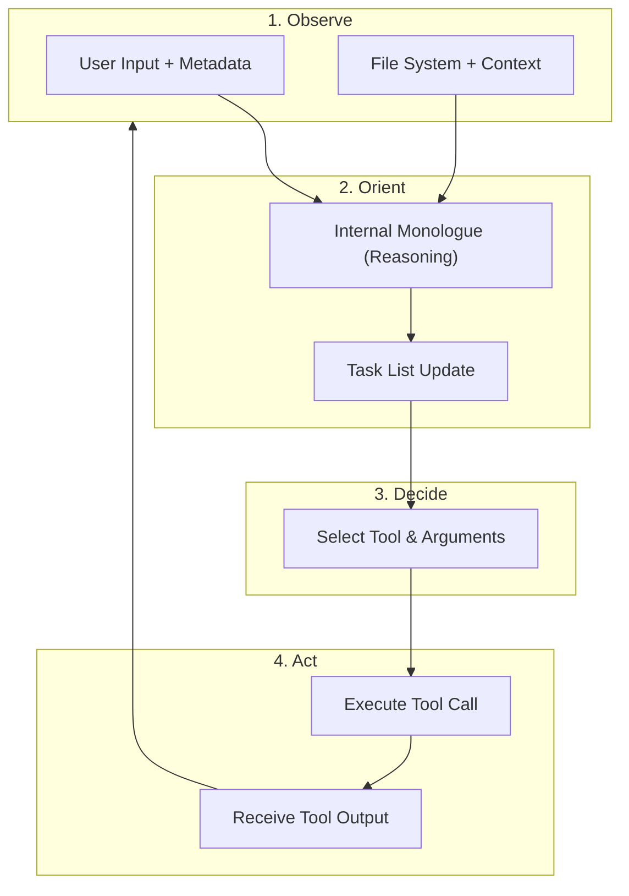
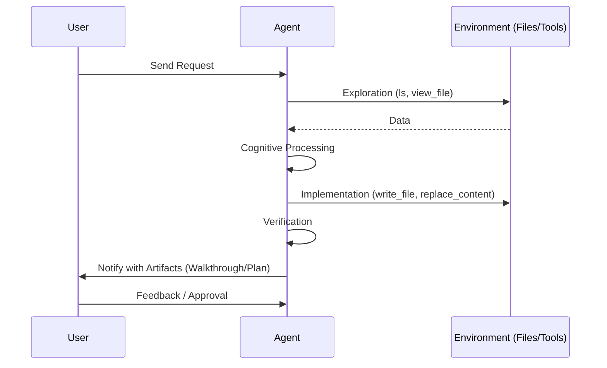
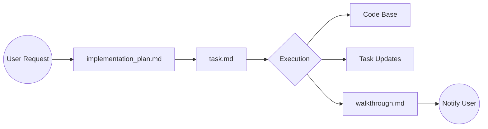

# Antigravity: Agent Internal Workings

This document explains the internal cognitive architecture and operational flow of the **Antigravity** agent using Mermaid diagrams.

## 1. The Core Cognitive Loop

Antigravity operates on a continuous feedback loop inspired by the **OODA** (Observe, Orient, Decide, Act) loop.

## 2. Collaborative Interaction Model

The agent interacts with the user through a structured communication channel, ensuring transparency and alignment.

## 3. State Management through Artifacts

To maintain consistency over long sessions, the agent uses persistent artifacts stored in the `.gemini/antigravity/brain/` directory.

## 4. Operational Modes

| Mode | Purpose | Primary Activity |
| :--- | :--- | :--- |
| **PLANNING** | Research and design | Creating `implementation_plan.md` |
| **EXECUTION** | Implementation | Modifying code, creating features |
| **VERIFICATION** | Quality assurance | Testing, creating `walkthrough.md` |

---

> [!NOTE]
> This architecture ensures that every action is grounded in context, planned for success, and verified for quality.
